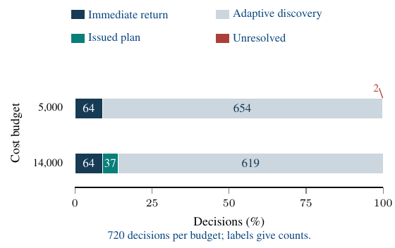
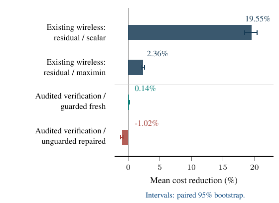
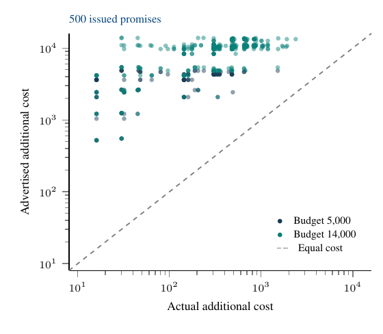
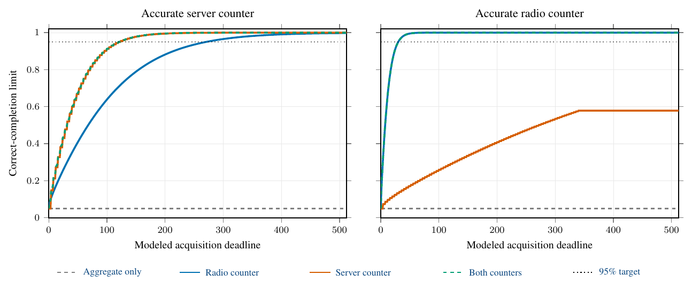

# Extended Experiments

This document collects the experimental protocols, retained numerical comparisons, and continuation guarantee. It accompanies *Service Certification for Agentic Wireless Networks*.

- [Definitions](#definitions-for-this-standalone-protocol)
- [Experimental protocols and matched comparisons](#experimental-protocols-and-matched-comparisons)
- [System boundaries and evidence scope](#system-boundaries-and-evidence-scope)
- [Simulation-based continuation selection](#simulation-based-continuation-selection)
- [References](#references)

We collect the complete experimental description from the supplied supplementary source, including additional numerical comparisons, figure data, and limitations. We retain each study's own population, comparator, and resource accounting.

**Available material.** The package supplies plotting scripts, summary data, editable figures, and protocol descriptions. The original simulation/controller drivers, complete trial records, and research directories cited in the source manuscript were not supplied. Accordingly, the scripts regenerate available figures; they do not rerun those experiments. Unmodified source fragments remain in [`docs/source/`](docs/source/), and [`docs/provenance.md`](docs/provenance.md) maps their contents. Statements about historical numerical outcomes below report the supplied manuscript's results, without asserting a new experimental replay.

**Manuscript alignment and implementation scope.** The active documentation is aligned with the current 13-page main paper and 7-page theoretical supplement as of 30 September 2026. This root-level Markdown file is the companion protocol referenced by the supplement. [`docs/manuscript_alignment.md`](docs/manuscript_alignment.md) distinguishes current documentation from preserved historical sources. The executable benchmark implements the exact scalar Gaussian frontier. The paper's multivariate finite-witness frontier and joint likelihood-state Bellman recursion have no numerical solver or policy-recovery implementation in this repository. The original experimental records cannot be reconstructed from the retained summaries; the alignment document lists the records required for replay.

## Definitions for this standalone protocol

For the nine-pair wireless instance, $R_i$, $f_j$, and $t_j$ denote radio rate, processor rate, and transport delay. The supplied manuscript sets $R=(20.574,51.891,100.556)$ Mbit/s, $f=(1,2,3)$ GHz, and $t=(0.8,1.2,1.8)$ ms. Tasks contain 80 kbit and require eight million processor cycles. With radio and server corrections $r_i,w_j$ in ms, we use

$$
\begin{aligned}
D_{ij}(\theta)&=d^0_{ij}+r_i+w_j, &d^0_{ij}&=80/R_i+8/f_j+t_j,\\
D_i^{\rm rad}(\theta)&=80/R_i+r_i.
\end{aligned}
$$

Charges satisfy $p_{ij}=p_i^{\rm rad}+p_j^{\rm srv}$, with $p^{\rm rad}=(1,2,3.6)$ and $p^{\rm srv}=(0.6,1.4,2.8)$. For goal parameters $(\alpha_g,T_g,T_g^{\rm rad})$, the service decision is

$$
\begin{aligned}
\min_{i,j}\quad &p_{ij}+\alpha_g D_{ij}(\theta)\\
\text{subject to}\quad &D_{ij}(\theta)\leq T_g,\\
&D_i^{\rm rad}(\theta)\leq T_g^{\rm rad}\quad\text{when requested}.
\end{aligned}
$$

The acquisition studies set $\alpha_g=0$. Symbol $\Phi$ denotes the standard normal cdf and $z_p=\Phi^{-1}(p)$. The following reference restates the scalar frontier used by the protocol; its proof remains in the paper and theoretical supplement.

#### Exact scalar completion reference

For centered Gaussian probe means $a_e\vartheta$, let $q_e=a_e^2/\sigma_e^2$ and let $A_{\max}$ be the greatest total precision available from history and a legal integer acquisition design. For $A_{\max}>0$ and $0<\delta<1/2$, the attainable correct-completion probability at $\vartheta\ne0$ is

$$
\Phi\!\left(|\vartheta|\sqrt{A_{\max}}-z_{1-\delta}\right).
$$

A maximum-precision fixed design and its two-threshold endpoint rule attain this value. Completion $1-\eta>\delta$ is possible exactly when $|\vartheta|\sqrt{A_{\max}}\geq z_{1-\delta}+z_{1-\eta}$.

At zero precision, operational policies abstain; the randomized reference can attain correct completion $\delta$ by assigning probability $\delta$ to each answer.

## Experimental Protocols and Matched Comparisons

Every comparison retains its own population, verifier, and denominator. Costs include all attempts and acquired reports; additional costs exclude sunk history, and modeled durations exclude computation. The availability statement above applies to the upstream records named in the original source.

### Wireless Model and Allocation

The nine-pair fixture uses evaluation-only correction means

$$
\begin{aligned}
(r_1,r_2,r_3)&=(2.409418,1.208761,.751280),\\
(w_1,w_2,w_3)&=(6.061585,2.113124,.935895).
\end{aligned}
$$

in milliseconds. Rates use bandwidths $(10,15,20)$ MHz and SNRs $(5,10,15)$ dB. Aggregate and radio-counter directions are $a_{ij}=\mathbf e_i+\mathbf e_{3+j}$ and $\mathbf e_i$; response coefficients follow [the delay model](#wireless-delay-model) and [the service decision](#service-decision). Background radio/server means are $80/R_i,5/f_j$, and tagged processor service is $8/f_j$. Workload caps $\overline w_k$ equal seven background means. Reports average $m_{\rm coh}=64$ independent finite-FCFS-population draws, with proxy

$$
\sigma_e^2=(4m_{\rm coh})^{-1}\sum_k a_{e,k}^2\overline w_k^2.
$$

This independence concerns synthetic diagnostics, not production packets. Aggregate costs/durations are $1+.35p_{ij}$ and $1+d_{ij}^0/20$; the R1 counter uses $12/2$ units. The window is 20000, and total-count caps are $\bar n_e=n_e^0+\lfloor20000/\ell_e\rfloor$, where $n_e^0$ is the historical type-$e$ report count. No monetary cap binds separately.

*Legacy scope.* Missing runners, seeds, paired outcomes, and bootstrap records prevent reproducing the earlier stage/wireless comparisons. Adverse cases include: scalar quotas cost 14.79 versus residual's 15.83 at 12.6 ms; loose-goal restart optimizer gaps exceed 90%; adding a common completion safeguard reverses residual/maximin stage costs from $136.09/198.25$ to $273.63/263.25$ on 32 seeds. 

*Published-rule adaptations.* Printed G-ACOL [1](#reference-1) measures the most uncertain remaining configuration. Authors-code commit `33fc4d2` instead selects that target $b_u$ and maximizes its one-report variance reduction,

$$
\frac{(b_u^{\mathsf{T}}Va_e)^2}{\sigma_e^2+a_e^{\mathsf{T}}Va_e},\qquad V=(M+.1I)^{-1},
$$

where $M$ is accumulated weighted information. Neither rule normalizes by price; regularization affects allocation only. We adapt noise, history, stage access, batching, and the common v10 `JointVerifier`, without transferring published guarantees.

The frozen comparison uses 64 paired sequences (seeds 57000000–57000063), goals $24\to12.6\to9.5\to24$ ms, $\epsilon=\delta=.05$, and retained initial counts

$$
(1024,1024,1024,1024,0,0,1024,0,0,0)
$$

in saved probe order. All retain the original window/caps. Batches contain at most eight reports; residual replans within 512 with inflation 1.1. All verify after batches/phase entry; greedy phase endings add checks without observations. Intervals use 10000 complete-sequence paired bootstraps (seed 57009999).

**Frozen 64-sequence allocation comparison. Every rule returns all 256 decisions correctly. Savings use each comparator's mean sequence cost; intervals are paired descriptive 95% bootstrap intervals.**

| Rule | Mean cost | Saving [95% interval] |
| --- | --- | --- |
| Residual | 2675.92 | — |
| Code lookahead | 2869.31 | 6.74% [6.43,7.05]% |
| Maximum variance | 2881.81 | 7.14% [6.83,7.47]% |

Lookahead is cheaper at 12.6 ms ($9.625/9.97625$), although residual costs less over every complete sequence. No method uses a stage probe; all loose and 50/64 intermediate goals need no reports. Controller times $.124/.225/.218$ s include unequal checks and simulation. An unchanged-code check correctly returns arm 8 on eight compatible nine-arm instances (mean 290 reports), without a residual comparator. The original source identifies a separate evidence record set for these checks; it was not supplied. These checks establish neither superiority over unchanged G-ACOL nor Fast Beam Alignment; maximin uses separate tapes.

### Stopping, Calibration, and Continuation Selection

*Fixed reserve.* The archived Gaussian comparison shares preparation, reserve, confidence, and potential reports across 120 paired attempts: 45 certify initially, 44 after the pilot, 14 during completion, and 17 remain unresolved with infeasible completion designs. For full-quota, block, proportional, and goal-directed execution, the respective mean costs are $4567.93$, $1194.59$, $1023.80$, and $1022.73$. The corresponding 14-trial means are $32654.50$, $3740.21$, $2276.29$, and $2267.14$. Goal-directed savings are therefore 77.6% overall, 93.1% conditionally, and only .10% against proportional stopping. A separate deterministic 93.5% illustration is not a stochastic estimate. Original raw execution records are missing.

The separate calibration comparison is described only by reference to an unavailable earlier supplement; its population and risk grid are not pooled here.

*Continuation selection.* Two separate 40-decision studies retain the same resources and mixture verifier ($V_0=10I$), using four cases, five seeds, and risks $.05,.01$. The selector combines directional/balanced/single-probe bases, four discovery reports/probe, at most 100 design iterations, and 512 simulated futures/candidate. Clopper–Pearson/transport allowances are $.01$ each. The declared holdout replaces 18 quota candidates by six full-quota candidates; the complete checkpoint and tie records were not supplied.

Initial baseline/selector correct counts are $40/32$ at costs $3396.68/3534.15$; holdout counts are $40/37$ at $2881.20/7872.13$. No wrong return occurs. Three server-only plans spend 49996 despite 512/512 simulated successes. All nonterminal gap bounds equal one; maximal selected lower bounds are $1.47\times10^{-35}/1.68\times10^{-159}$. The transport bounds are valid but uninformative. Median/95th-percentile computation is $60.8/154.5$ ms for the corrected selector versus $16.5/210.2$ ms for baseline; unequal checkpoints confound allocation-cost attribution.

### Audited History and Guarded Acquisition

*Paid audits.* The earlier Gaussian study crosses physical residuals $b\in\{0,.15,.35\}$, historical shifts $d\in\{0,.35,1\}$, 80 tapes/cell, and budgets $(B,H)=(5000,4000),(14000,9000)$: 1440 attempts/method. Current means are $(1,1)$, aggregate/stage limits $(2.9,1.9)$, and the fallback costs one ($\epsilon<1$). Unit-variance aggregate/stage-2 probes have prices $(1,8)$, durations $(1,4)$, 512 historical reports each, shifts $(d,d/2)$, and total/new caps 4000/3488. Auditing acquires 128 reports/probe (cost 1152, duration 640) and admits history when

$$
U_e=|\overline Y_{e,h}-\overline Y_{e,128}|+
\sqrt{2(1/512+1/128)\log(4/.005)}\leq.9.
$$

Audit and four-mask risks are $.005$ each; the archived verifier adds shift and physical envelopes. Discarded history consumes quota. Fresh/audited pilots are 16/128; adaptive batches of at most 16 maximize predicted certificate-ratio improvement/price, while proportional acquisition targets aggregate/server counts $A/S=\sqrt8$. Sufficient plans precede adaptive discovery, with issuance/failure allowance $.105$ and return risk $.01$.

**Paid audits: mean cost and correct returns out of 1440 attempts. All remaining attempts are unresolved; no incorrect return occurs.**

| Method | Cost | Correct |
| --- | --- | --- |
| Fresh adaptive, pilot 16 | 2002.24 | 1432 |
| Audited adaptive | 2023.39 | 1438 |
| Audited sufficient | 2023.21 | 1438 |
| Audited proportional | 2011.10 | 1438 |
| Fresh adaptive, matched pilot 128 | 2013.97 | 1438 |

*Observed outcomes of the sufficient-plan controller. Each budget
uses the same 720 tapes; time allowances are 4000 and 9000 units. All paths
include the 1152-unit audit. Successful issued plans are distinguished from
immediate verification and adaptive discovery.*

Of 1312 post-audit attempts, 37 issue plans; all discard history and complete under the larger budget, reserving/spending $11682.27/60.97$ additional units on average. Immediate/discovery correct counts are $128/1273$, with two unresolved. Matched fresh pilots reproduce every audited completion. Adaptive and sufficient excess costs are $9.42$ and $9.24$, with respective paired 95% intervals $[-2.78,20.96]$ and $[-2.98,20.78]$: no net reuse benefit. A separate zero-shift reference's 160 historical completions assume stronger validity information.

*Guarded confirmation.* Nine methods use 21 declared labels, 32 tapes each, and two budgets (1344 attempts/method); three extension tuples duplicate originals on independent tapes. The primary fixes fresh acquisition actions and uses audited history only in verification/promises. Paired bootstraps preserve labels, tapes, and budgets. Declared targets are a saving lower endpoint above 2% and completion-difference lower endpoint above $-1$ point.

**Guarded confirmation: all 1344 decisions per method. Remaining decisions are unresolved; none is incorrect.**

| Method | Mean cost | Correct |
| --- | --- | --- |
| Fresh proportional | 3021.64 | 1128 |
| Fresh repaired | 2962.29 | 1128 |
| Fresh slack | 2947.11 | 1128 |
| Guarded fresh | 2996.73 | 1129 |
| Audited, history-guided | 2994.15 | 1128 |
| Audited, balanced | 3015.73 | 1129 |
| Audited, fixed fresh actions | 2992.60 | 1129 |
| Earlier audited repaired | 3130.14 | 1128 |
| Earlier sufficient | 3130.14 | 1128 |

Primary saving is $.138\%$ (95% interval $[.082,.201]\%$), below the 2% target. Both primary and guarded fresh complete 575/576 original-grid and 554/768 extension decisions; 192 attempts are boundary/low-margin cases. Only 57 paths save strictly (maximum 304), all respecting fixed-action cost/duration ordering. Relative to fresh repaired, primary costs 1.023% more for one extra completion. Its 4.394% gain over earlier audited controllers changes initial auditing and does not isolate planning.

*Separate frozen comparisons. The upper rows confirm existing nine-configuration wireless controllers on 32 complete four-goal sequences; the lower rows evaluate the new audited-verification variant on 1344 two-instrument decisions. Positive values denote lower all-attempt cost. The last comparison has one additional completion for the audited variant. Intervals preserve the paired experimental units; the populations and controller interfaces are not pooled.*

Primary/guarded fresh issue 500/484 promises, and all primary promises complete. Earlier sufficient acquisition issues 39/1152 under a different audit and $.105$ allowance. Primary mean spent/reserved-additional/actual-additional costs are $874.13/7352.62/347.89$; advertised/actual totals are $8226.76/1222.03$ (median ratio 6.75). Selected successes and unacquired endpoint replays establish no uniform conditional guarantee.

*Advertised and actual additional acquisition cost for the primary controller's 500 issued promises. Both axes are logarithmic. All promises complete in these trials, but reservations are conservative. These selected-promise diagnostics complement the all-attempt comparison in [the guarded confirmation table](#guarded-confirmation-table); they do not establish a conditional probability guarantee.*

Separate four-goal epochs share an evidence/cap ledger and risk $.03/4$ across thresholds $(5.8,4.8)\to(2.9,1.9)\to(1.4,.9)\to(5.8,4.8)$. Both primary/guarded fresh complete 563/576 epochs, costing $2196.56/2210.54$ (saving $.633\%$, interval $[.319,1.022]\%$). Primary can cost more at goal three; final relaxed goals need no reports. History-guided/balanced variants cost $2184.72/2379.14$ with 563/562 completions.

The separate nine-pair confirmation uses 32 new four-goal sequences/interface. Residual reaches estimated alternative distance $1.10\beta^2$ at minimum cost. Custom information-maximin maximizes minimum distance using an added-cost planning allowance of current-goal expenditure plus $\sum_ec_e$ (64 iterations, tolerance $.005$). This allowance is not a hard budget; the shared executor enforces original count/time limits, unlike the resource-aware planning rule described in [the implementation guide](docs/implementation.md#residual-and-comparator-allocations). Residual/scalar costs are $2661.84/3308.72$ (19.55%, interval 18.46–20.40%); residual/custom-maximin costs are $2739.90/2806.12$ (2.36%, interval 2.13–2.57%). All 512 decisions are correct; 22/32 intermediate and all loose requests need no reports. The development/final attempts, detailed audit records, and vendored comparison source cited by the original manuscript were not supplied. The two-instrument controller is not evaluated on nine pairs.

## System Boundaries and Evidence Scope

### Instrumentation, Priors, and Agent Operation

The four-configuration model has $\theta=(r_0,r_1,w_{00},w_{01},w_{10},w_{11})$ and $D_{ij}=r_i+w_{ij}$, including nominal stage terms. Aggregate rank is 4, increasing to 5/6 with one/two radio counters. Charges are $(1.6,2.4,2.6,3.4)$, tolerance $.05$, and total/radio/server limits $24/3.8/8.5$ ms. Reports average 64 independent finite-buffer FCFS pre-admission workload draws, including rejected jobs: the target is diagnostic mean, not offered-job latency. Studies A–C start with 256 reports/aggregate (sunk 1920), batches 32, and caps 4096. Prefix radii are

$$
h_e(n)=\sqrt{(2\sigma_e^2/n)\log(2\cdot6\cdot4096/\delta_{\rm on})}.
$$

We intersect earlier intervals, priors, and admitted contrasts without resetting goal risk; empty intersections return model conflict. Exact-rational LP-witness audits check algebra separately from coverage.

*A: common allocation.* Both verifiers use smallest-count acquisition, tied fast radio/slow radio/aggregates, truncated at full batches for deadlines 150/2000. Thirty-two seeds pair states shifted by $+2$ ms radio/$-2$ ms server, preserving aggregates/nonnegativity but changing the valid answer (configuration 3/infeasibility). Aggregate-only correct completion is at most $\delta$; nonabstention may reach $2\delta$. This construction changes server nominal terms, not merely the FCFS random seed.

**Original zero-lower-bound comparison: correct count / mean new cost in each matched state at duration 2000. Completion counts also hold at 150.**

| Access | Joint | Componentwise |
| --- | --- | --- |
| Aggregate only | 0/32;2449.92 | 0/32;2449.92 |
| Aggregate+fast radio | 32/32;384 | 0/32;6745.92 |
| All six | 32/32;384 | 32/32;768 |

Joint exclusion uses total delay above $3.8+8.5$ without identifying the violated stage; selected-action feasibility still needs stage evidence. At 150, unresolved aggregate-only/single-counter componentwise costs are $169.92/768$. Wilson 95% intervals for 32/32 and 0/32 are $[89.3,100]/[0,10.7]\%$; two deadlines locate no transition.

*Prior correction.* The generator's valid radio minima $(3.88845,1.54168)$ ms were omitted originally. Replay strengthens these equally, retaining tapes, bands, and goals, and adds no invalid server bounds. Both verifiers then complete 32/32 at cost 384/duration 64 in each state: the one-counter advantage disappears. Below, original practical curves explicitly retain the broader zero-lower-bound prior. The full prior-sensitivity replay records were not supplied.

*B: interactions.* Under radio-dependent server loading, flexible and calibrated-contrast models certify infeasibility from history in all 16 trials; nominal-equality modeling gives 16 conflicts. A constructed common server shift preserves contrasts. All 32 calibration sets cover, with no demonstrated acquisition-cost benefit or physical-transfer guarantee. The supplied text does not specify the separate calibration expenditure, risk split, or full interaction parameters.

*C: common verifier.* Coverage/custom-maximin/residual share flexible priors, all instruments, 16 seeds/coupling, and duration 2000. Common LP repair produces regularized centers; plans cache at most 256 reports and maximin uses 12 iterations. At zero coupling all complete at costs $384/454.08/524.16$ and controller times $.038/.076/.143$ s. At $.24$, history completes all at zero new cost. Fixed batches give degenerate paired intervals, not population certainty. This adverse comparison is separate from nine-pair gains.

*D: agent loop.* One language-model agent accesses public goals/evidence through proposal, acquisition, verification, and authorization tools. Isolation is procedural; the exact model version is unavailable. Loose/joint/loose goals share history; an announced change quarantines it before the final joint goal. Each epoch uses risk $.025$ and cost/duration caps 2000. Agent and deterministic coverage return $0,3,0$, then infeasibility. Their totals are 23/45 actions, costs $2133.76/2124.80$, and durations $729.44/735.20$; the agent acquires 448 reports, none at loose goals. One sequence proves no LLM advantage. The cited attempts, transcripts, 16 guard checks, and certificate/resource replay files were not supplied.

*Exact correct-completion limits at absolute stage margin $0.2$,
wrong-return risk $0.05$, and hard cost cap 512. Lines give the exact
reference. Counter precision changes
which instrumentation can meet a deadline. The aggregate-only line is a
randomized 5% upper bound; our operational policies always abstain in
that case. Radio and both-counter curves coincide in the right panel.
Durations are modeled acquisition units.*

**Practical results at deadline 512. Ordered pairs correspond to radio limits $(3.1,3.8)$ ms; each correct count is out of 16 seeds. C: coverage; G: goal-directed. Both orientations agree with all probes. Costs include unresolved attempts; unequal completion prevents equivalent-service cost ratios. History adds 1920 sunk units.**

| Orientation | History/probe | Access | C correct | G correct | C cost | G cost |
| --- | --- | --- | --- | --- | --- | --- |
| Both | 0 | All | (0, 0) | (16, 16) | (1615.10, 1615.10) | (1628.75, 1004.89) |
| Both | 256 | All | (15, 16) | (16, 16) | (2517.00, 564.00) | (1275.00, 297.00) |
| 0 | 0 | Fixed 5 | (0, 0) | (16, 16) | (1248.00, 1248.00) | (1564.69, 974.63) |
| 0 | 256 | Fixed 5 | (16, 16) | (16, 16) | (1275.00, 297.00) | (1275.00, 297.00) |
| 1 | 0 | Fixed 5 | (0, 0) | (0, 0) | (1248.00, 1248.00) | (880.04, 918.77) |
| 1 | 256 | Fixed 5 | (0, 0) | (0, 0) | (3072.00, 3072.00) | (832.20, 832.20) |

### Completion Frontiers and Practical Curves

The scalar Gaussian benchmark has cheap-stage means $(6+\vartheta,6-\vartheta)$, limits $(6,7,13)$, and a costlier safe backup. For $0<|\vartheta|<.8$, negative/positive margins uniquely favor cheap/backup. Centered aggregate/radio/server means are $0,\vartheta,-\vartheta$. Radio/server costs are $(1,6)$, durations $(1,4)$, and accurate-server variances $(1,1/9)$, reversed for accurate radio; history is empty and cost/count caps are 512. A public-parameter dynamic program maximizes precision $A_{\max}(H)$ for integer $H\leq512$. [The exact scalar completion reference](#exact-scalar-completion-reference) gives the exact frontier and attaining endpoint test. At zero precision, operational policies abstain although randomization permits 5% correct completion.

**Exact first modeled deadline for 95% correct completion, wrong-return risk $.05$, and cost cap 512. Dashes remain unattainable with more time. Both signs agree.**

| Catalogue | Counter | $\lvert\vartheta\rvert=.1$ | $.2$ | $.4$ |
| --- | --- | --- | --- | --- |
| Accurate server | Radio | — | 271 | 68 |
| Accurate server | Server | — | 124 | 32 |
| Accurate server | Both | — | 121 | 32 |
| Accurate radio | Radio | 121 | 31 | 8 |
| Accurate radio | Server | — | — | 272 |
| Accurate radio | Both | 121 | 31 | 8 |

At margin $.1$, accurate-server precision caps at 767 and completion at $.869626$. Sequential execution orders the same design by precision/duration, spending one-sided risk $.01/[j(j+1)]$ at report $j<N$ and $.04$ at the endpoint (single-report risk $.05$). Each deadline defines a separate valid policy.

Evaluation crosses margins $\pm.1,\pm.2,\pm.4$ and deadlines $0,8,32,128,512$: 4096 seeds in each of 480 cells, totaling 1,966,080 correlated outcomes. Maximum endpoint discrepancy across 144 positive-information cells is 1.545 points (standardized 2.628). At preselected $\vartheta=.2$, both counters/accurate server/$H=128$, endpoint versus sequential returns 3919/3877 correct, 0/2 wrong, and 177/217 unresolved, costing $192/164.883$. Other endpoints also trade lower cost for missed or incorrect returns; complete outcome records were not supplied. Early stopping does not improve cost and completion uniformly.

*Practical policies.* The bounded six-mean/zero-lower-bound model crosses both radio-row orientations, radio limits 3.8/3.1, history 0/256, and all probes versus aggregates plus fixed counter 5. The counter is useful in only one orientation. Caps/risk/batches are $4096/.05/4$; history costs 1920. Coverage selects smallest absolute count with seeded random tie order. Goal-directed acquisition targets the cheapest unexcluded configuration and maximizes unresolved directional uncertainty reduction/duration; regularization guides allocation only. One sequence/policy is truncated before unaffordable batches at $H=0,16,32,64,128,256,512$. Sixteen paired seeds yield 512 traces/3584 deadline views; Wilson and 10000 seed-cluster bootstrap intervals preserve paired orientations/deadlines. These curves are policy-specific.

The wrong-counter obstruction $v=(0,2,0,0,-2,-2)$ preserves aggregate and observed slow-radio laws but changes configuration 3 to infeasibility, respecting the stated prior/noise model. Correct completion is therefore at most $\delta$ for every deadline; known server-row equality removes that alternative. Unresolved all-instrument prefixes prove no such impossibility. The original source references additional protocols and design/tape/stopping/certificate audits that were not supplied. The 604 approved deadline views contain no error but are correlated.

### Physical Evidence and Reproduction Limits

No experiment uses a live wireless–edge link. Additive-model holdout RMSE rises from $.166$ ms under shared load to $2.066/4.449$ ms with server interactions (noiseless $2.047/4.386$): sampling cannot remove structural error. Historical EdgeDroid [2](#reference-2) and localhost summaries lack the raw observations, harnesses, splits, or timestamp logs needed for reproduction. Missing latencies are not imputed; observed residuals do not validate unseen stage delays.

The original manuscript reports 18 synthetic integrity cases that verify only the record schema; their source files were not supplied.

## Simulation-Based Continuation Selection

The following construction preserves the full simulation-based selector guarantee from the original supplementary source. Probe $e$ has Gaussian mean $a_e^{\mathsf{T}}\theta$, variance $\sigma_e^2$, and one-report information matrix $G_e=a_ea_e^{\mathsf{T}}/\sigma_e^2$. The set $\mathcal Q_{\rm int}$ denotes the original legal integer fresh-count vectors under the total count, time, and cost caps; discovery counts remain charged. For $M\succeq0$, write $\|v\|_M^2=v^{\mathsf{T}} Mv$, and use $P^\dagger$ for the Moore–Penrose inverse. The common verifier has a simultaneous unconditional wrong-return risk at most $\delta$ under every admissible acquisition rule. The notation $P^\star(\delta,B)$ denotes the paper's unrestricted correct-completion frontier under this risk and resource bound. These are the assumptions under which the construction below applies.

### An Implementable Continuation Guarantee

At a legal discovery stopping time, let $\mathcal H$ contain retained/discovery reports and $d$ the discovery counts. Completed returns are absorbing; otherwise $K_c$ executable candidates $\pi_k(\mathcal H)$ share the original verifier and remaining set $\mathcal Q_{\mathcal H}=\{n\in\mathbb Z_+^E:d+n\in\mathcal Q_{\rm int}\}$. The fixed-goal Gaussian subclass has a unique answer at every admitted regular coefficient.

Choose a center $\vartheta_0=\widetilde\theta(\mathcal H)$ and an anytime set $\mathcal C(\mathcal H)$ of coverage $1-\delta_{\rm est}$. For a set $\mathcal Q_{\mathcal H,k}$ containing all possible candidate counts, put

$$
\rho_k=\sup_{v\in\mathcal C(\mathcal H)}
\max_{n\in\mathcal Q_{\mathcal H,k}}
\|v-\vartheta_0\|_{M_{\rm new}(n)},\qquad
M_{\rm new}(n)=\sum_e n_eG_e.
$$

For $\mathcal C=\{v:\|v-\vartheta_0\|_P^2\leq2b\}$, $P\succeq0$, $b>0$, and componentwise quotas $n_k$, a valid radius is $\rho_k^2=2b\lambda_{\max}(P^{\dagger/2}M_{\rm new}(n_k)P^{\dagger/2})$ when $\operatorname{range}(M_{\rm new}(n_k))\subseteq\operatorname{range}(P)$; otherwise use infinity.

Let $q_v^k$ be the conditional probability of any verified return when future reports use coefficient $v$, holding actual history fixed. Prespecify candidates and $L_{\rm MC}$ independent simulations per candidate under $\vartheta_0$. Simultaneous conditional $1-\delta_{\rm MC}$ intervals $[l_k^{\rm MC},u_k^{\rm MC}]$ follow from Hoeffding half-width $\sqrt{\log(2K_c/\delta_{\rm MC})/(2L_{\rm MC})}$, or Clopper–Pearson tails $\delta_{\rm MC}/(2K_c)$. Candidates may share randomness. Define $T_\pm(q,r)=\Phi(\Phi^{-1}(q)\pm r)$, with continuous endpoints, and

$$
L_k=T_-(l_k^{\rm MC},\rho_k),\qquad
U_k=T_+(u_k^{\rm MC},\rho_k).
$$

Use $[0,1]$ if $\rho_k=\infty$. Execute a maximizer $\widehat k$ of $L_k$ and put $\Delta=\max_kU_k-L_{\widehat k}$; an approximate selector uses its actual lower bound.

#### Finite-confidence continuation intervals

With probability at least $1-\delta_{\rm est}-\delta_{\rm MC}$ over
history, discovery, and simulation randomness, simultaneously

$$
L_k\leq q_\theta^k\leq U_k\quad\text{for all }k,\qquad
 \max_k q_\theta^k-q_\theta^{\widehat k}\leq\Delta.
$$

The composed controller is uniformly $\delta$-safe. For conditional
correct-completion probabilities $p_\theta^k(\mathcal H)$, define the
same-discovery oracle for discovery strategy $D$,
$P^*_{D,K_c}(\theta)=\mathbb E_\theta\max_k p_\theta^k(\mathcal H)$.
Then

$$
\begin{aligned}
 \Pr_\theta\{\mathrm{correct\ return}\}
 &\geq\mathbb E_\theta L_{\widehat k}-\delta_{\rm est}-\delta_{\rm MC}-\delta,\\
 \Pr_\theta\{\mathrm{correct\ return}\}
 &\geq P^*_{D,K_c}(\theta)-\mathbb E_\theta\Delta\\
 &\quad-\delta_{\rm est}-\delta_{\rm MC}-\delta.
 \end{aligned}
$$

**Proof.** Condition on $\mathcal H,k$. On $\theta\in\mathcal C(\mathcal H)$, every continuation has Gaussian information separating $\theta,\vartheta_0$ at most $\rho_k^2$. The Gaussian information-time comparison proved in the associated paper and Neyman–Pearson applied to return and its complement give

$$
T_-(q_{\vartheta_0}^k,\rho_k)\leq q_\theta^k
\leq T_+(q_{\vartheta_0}^k,\rho_k).
$$

Actual history stays fixed; the selected center is not assigned a fixed Gaussian law. Combine monotonicity with simultaneous simulation coverage, then subtract endpoints for $\Delta$. No independence between confidence events is required.

Conditional on history and selection randomness, physical future reports are independent of simulations, so the composed return probability is $\mathbb E_\theta q_\theta^{\widehat k}$. Integrating the interval/gap bounds costs at most $\delta_{\rm est}+\delta_{\rm MC}$. Since $q_\theta^k\geq p_\theta^k$, subtract the common verifier's unconditional wrong-return risk $\delta$ once to obtain [the correct-completion guarantees](#correct-completion-guarantees). Discovery returns remain absorbing. ∎

The guarantee provides neither conditional safety after selected history nor an impossibility test when $L_k$ is small. Larger quotas may enlarge $\rho_k$. Selection costs $O(K_cL_{\rm MC}NT_{\rm pl})$ for at most $N$ simulated reports and per-report computation $T_{\rm pl}$; charge this when the deadline includes computation.

Comparison to unrestricted $P^\star$ additionally subtracts the restriction gap

$$
G_{D,K_c,\mathcal V}(\theta)=P^\star(\delta,B)-P^*_{D,K_c}(\theta)\geq0.
$$

The finite-class oracle shares discovery, resources, and verifier, with $\theta$ a pointwise design constant, not implemented input. Hard budget $B$ makes its mean-cost cap redundant; a smaller expected-cost ceiling requires a separate feasibility certificate. The experiments do not bound this restriction gap. The optional quota-selection variants referenced by the original source were not supplied.

### Numerical Adaptive-Instrument Reference

The separate finite-resource adaptive-separation example uses a near stage with absolute margin between $d_{\min}$ and $d_{\max}$ and another stage in $[-D_{\max},-D]$. The numerical example uses no historical reports. Its parameters match the current theoretical supplement:

$$
(d_{\min},d_{\max},D,D_{\max})=(0.1,0.2,1,1),\qquad
(\sigma_D^2,\sigma_1^2,\sigma_2^2)=(25,1,1).
$$

Each coarse acquisition returns a pair of scalar stage observations with independent Gaussian errors of variance $\sigma_D^2$ per coordinate. We treat this pair as one vector-valued acquisition bundle: its declared price, duration, and coarse count apply once to the pair. A fine report measures its selected stage, and all fresh report errors are independent. Bundle/fine durations are $(1,4,4)$, prices are $(1,8,8)$, and acquisition caps are $(224,307,307)$. We use $(\delta,\delta_D,\delta_C)=(0.05,0.01,0.04)$, deadline $H=1500$, and budget $B=3000$. The adaptive rule takes 224 coarse acquisitions, selects the larger coarse mean, and acquires 307 fine reports of that stage. Its duration is $224+4\cdot307=1452$ and its cost is $224+8\cdot307=2680$. The fixed-plan lower bounds in the theoretical supplement, including randomized plans, are $2164.43$ duration units and $4328.87$ cost units. This is the stated Gaussian numerical specialization under a separated-branch promise, not a replay of a physical deployment or evidence of general adaptive optimality.

## References

[1] D. Lindner, S. Tschiatschek, K. Hofmann, and A. Krause, “Interactively learning preference constraints in linear bandits,” in *Proc. ICML*, ser. PMLR, vol. 162, 2022, pp. 13505–13527.

[2] M. O. J. Olguín Muñoz, J. Wang, M. Satyanarayanan, and J. Gross, “EdgeDroid: An experimental approach to benchmarking human-in-the-loop applications,” in *Proc. ACM HotMobile*, 2019, doi: 10.1145/3301293.3302353.
